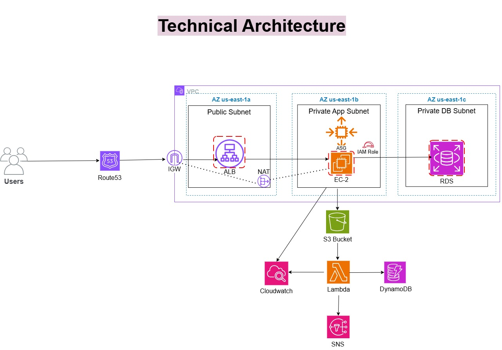
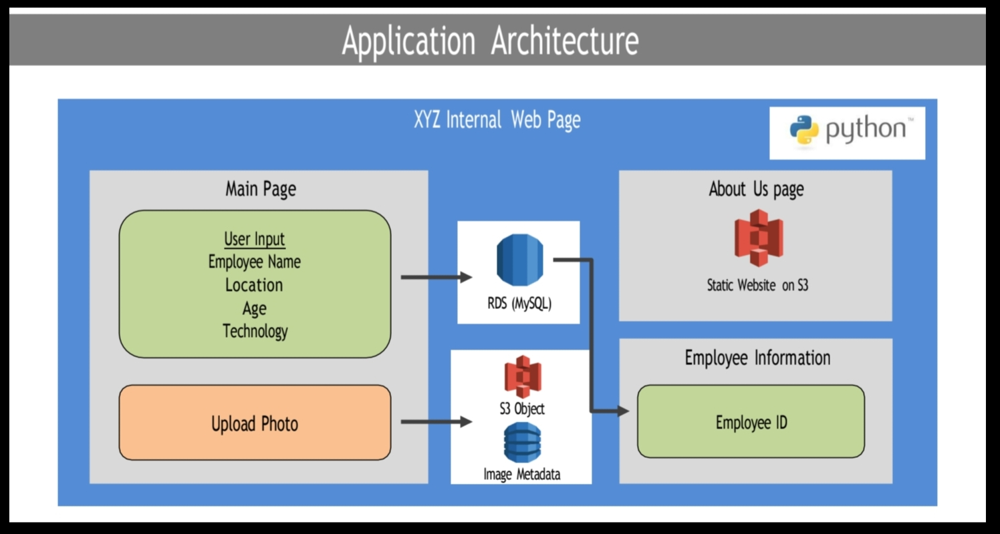
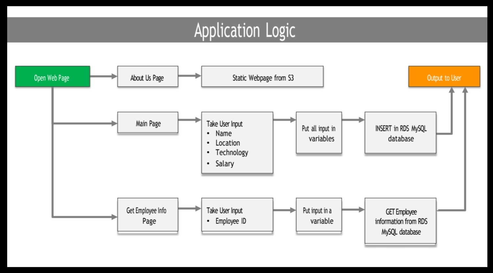

# AWS Employee Management System

## Project Type

AWS Cloud Architecture Capstone Project

---

# Project Overview

This project demonstrates the design and deployment of a **secure, scalable, and highly available Employee Management System on Amazon Web Services (AWS)**.

The system allows users to:

* Add employee information
* Upload employee images
* Retrieve employee records
* Store images securely
* Trigger automated backend processing

The architecture integrates multiple AWS services including compute, networking, storage, databases, and serverless components to simulate a **real-world cloud application deployment**.

---

# Technical Architecture Diagram 



---

# Application Architecture Diagram



---

# Application Logic Diagram



---

# Architecture Summary

The infrastructure is deployed within a **custom Virtual Private Cloud (VPC)** with subnet isolation to ensure security and scalability.

## Network Design

* Custom VPC
* Public Subnet
* Private Application Subnet
* Private Database Subnet
* Internet Gateway attached to VPC
* NAT Gateway for outbound internet access
* Custom route tables

### Public Subnet

* Application Load Balancer
* NAT Gateway
* Bastion Host

### Private Application Subnet

* EC2 instance running PHP application
* Auto Scaling Group

### Private Database Subnet

* Amazon RDS MySQL instance

The database is **not publicly accessible** and can only be accessed from the application layer.

---

# AWS Services Used

Compute

* Amazon EC2
* Auto Scaling Group
* Application Load Balancer

Storage

* Amazon S3

Databases

* Amazon RDS (MySQL)
* Amazon DynamoDB

Serverless

* AWS Lambda

Networking

* Amazon VPC
* Internet Gateway
* NAT Gateway
* Route Tables
* Bastion Host

Messaging

* Amazon SNS

Monitoring

* Amazon CloudWatch

DNS

* Amazon Route 53

Security

* IAM Roles
* Security Groups

---

# Application Features

* Employee information submission
* Employee data retrieval
* Image upload functionality
* Image storage in Amazon S3
* Image metadata stored in DynamoDB
* Lambda triggered on image upload
* SNS notification system
* Static About page hosted on S3
* Load balanced web application
* Auto scaling infrastructure

---

# Skills Demonstrated

* AWS Cloud Architecture Design
* VPC Networking and Subnet Isolation
* Bastion Host Secure Access Pattern
* Load Balanced Web Applications
* Auto Scaling Infrastructure
* Hybrid Database Architecture (RDS + DynamoDB)
* Serverless Integration (Lambda + SNS)
* Object Storage with Amazon S3
* Event-Driven Architecture
* Monitoring with Amazon CloudWatch
* DNS Management with Route 53

---

# System Architecture Flow

**User Request Flow**

User
↓
Route 53
↓
Application Load Balancer
↓
Auto Scaling EC2 (Private Subnet)
↓
Amazon RDS (MySQL)

**Image Processing Flow**

User Upload
↓
Amazon S3
↓
AWS Lambda Trigger
↓
DynamoDB Metadata Storage
↓
SNS Notification

---

# High Availability & Scalability

The architecture follows AWS high availability design principles:

* Application Load Balancer distributes traffic
* Auto Scaling replaces unhealthy instances
* Database isolated in private subnet
* Stateless web application architecture
* Serverless backend processing

---

# Security Implementation

Security best practices implemented include:

* Bastion Host for secure SSH access
* Private subnets for EC2 and RDS
* No public access to database
* IAM roles instead of embedded credentials
* Restricted security group rules
* S3 bucket policies for controlled access
* Private configuration files for sensitive data

---

# Deployment Guide

Detailed deployment instructions are available in the `docs` folder.

See:

docs/deployment-guide.md

---

# Project Structure

```
AWS-Capstone-Project (aws-employee-management-system)
│
├── application-code
├── architecture
├── database
├── docs
├── iam_policies
├── lambda
├── screenshots
└── README.md
```

---

# Author

Akshatha
AWS Capstone Project – Employee Management System on AWS
